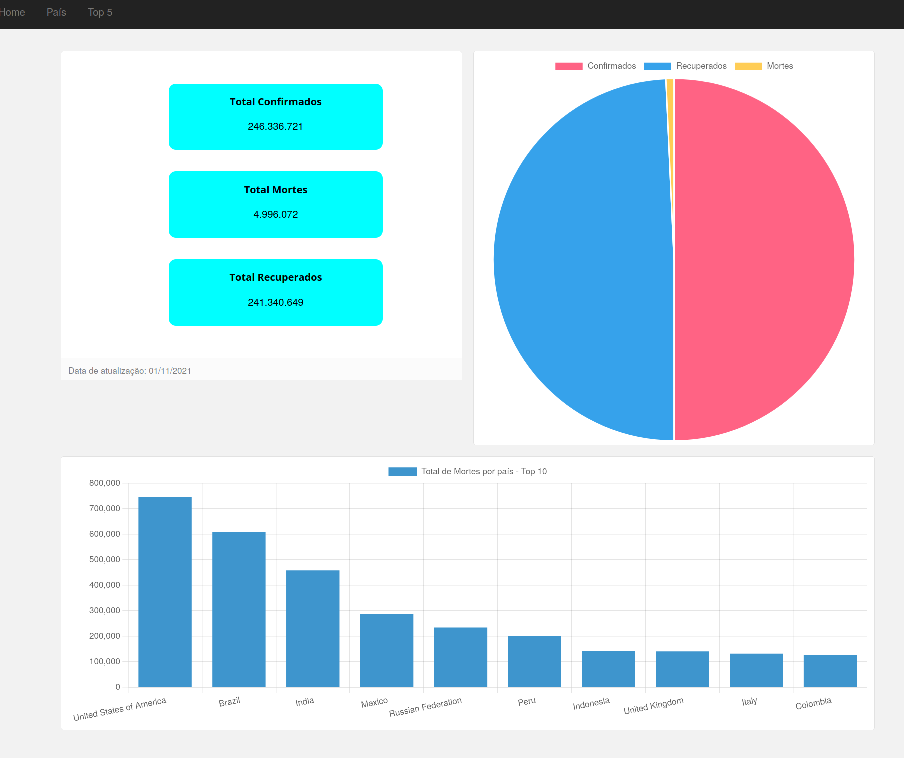
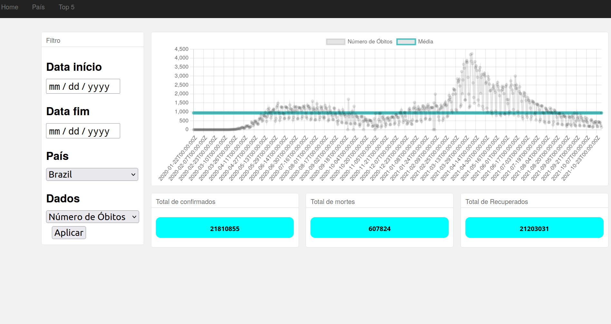

# Dashboard Covid 19
- Filtro por país, datas, casos confirmados, óbitos e recuperados
- Visão geral com top 10 dos países com o maior número de óbitos

## Tech stack
- Vanilla js
- `Axios` para fazer requisições http para a API (https://api.covid19api.com)
- `Chartjs` para os gráficos
- `Lodash` para manipulação de dados

